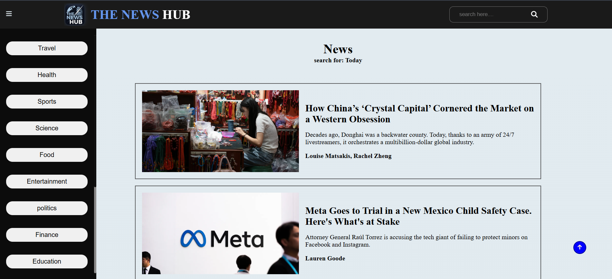

# The News Hub 📰

**The News Hub** is a responsive full-stack news web application that allows users to browse trending news articles, search for specific topics, and filter news by categories. The app fetches live news data from the [NewsAPI](https://newsapi.org/). It works seamlessly across desktops, tablets, and mobile devices.

## **Features**

* Search for news articles by keyword.
* Browse news by categories such as Travel, Health, Sports, Science, and more.
* Responsive sidebar menu for easy navigation.
* Smooth scrolling and “back to top” button.
* Fully responsive design for desktop, tablet, and mobile.
* Live news fetched via [NewsAPI](https://newsapi.org/).

## **Demo Screenshot**




## **Technologies Used**

* **Frontend:** HTML, CSS, JavaScript
* **APIs:** [NewsAPI](https://newsapi.org/)
* **Icons:** [Font Awesome](https://fontawesome.com/)
* **Responsive Design:** Media queries for mobile, tablet, and desktop


## **Folder Structure**

```
the-news-hub/
│
├── image/                  # Logo and image assets
├── news.css                # Main CSS file
├── mediaquery.css          # Media query CSS for responsive design
├── news.js                 # JavaScript logic for fetching and displaying news
├── index.html              # Main HTML file
└── README.md               # This file
```


## **Usage**

1. **Search**

   * Type a topic in the search bar and press **Enter**.
2. **Category Navigation**

   * Click on a category in the sidebar to filter news.
   * On mobile, click the **hamburger menu** to show/hide the sidebar.
3. **Scroll Up**

   * Use the **up arrow button** to scroll back to the top of the page.

## **Responsive Design**

* **Desktop:** Sidebar visible by default, full news layout.
* **Tablet:** Sidebar collapses, cards resize, navigation optimized.
* **Mobile:** Hamburger menu toggles sidebar, cards stack vertically, search and buttons remain accessible.


## **License**

This project is open-source and free to use.
